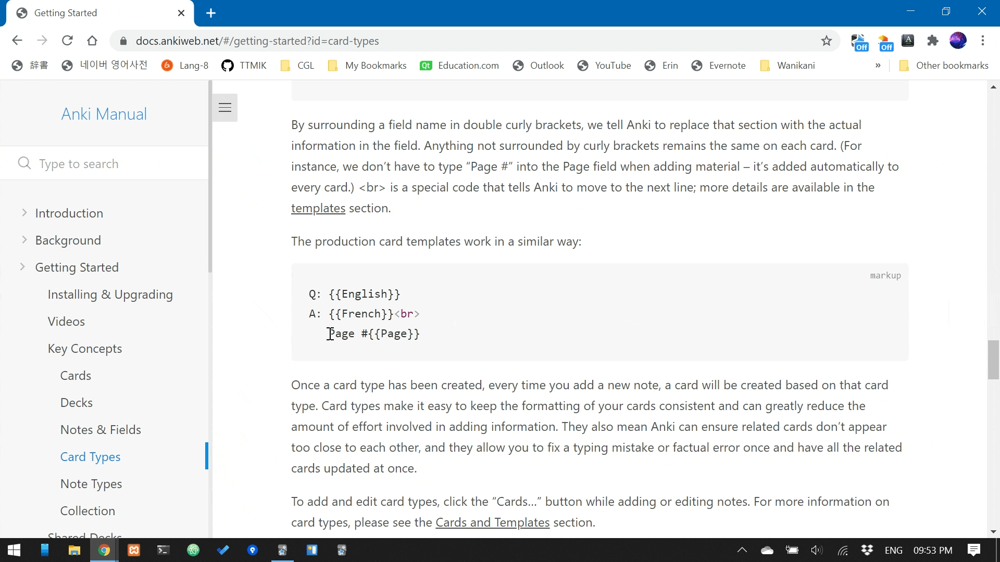

# Ruzu Pop-ups Anki Addon
Ruzu Pop-ups is an [Anki](https://apps.ankiweb.net/) addon that periodically presents Anki cards using a small pop-up window.
This allows you to review Anki decks whilst working on other important tasks!
Cards from your chosen deck will periodically pop up for you to review.

## Features
- Review fully rendered Anki cards within pop-up
- Deck select
- Set how often cards pop up (every 5 mins, 10 mins etc)
- Currently supports text based Anki decks and models only.

## Future Features
- Choose pop-up location / size
- Shortcuts to enable / disable pop-ups or show the next card early
- Optional markers for marked and flagged cards

## Getting Started
You can enable and configure the addon within the options menu:

- Tools -> Ruzu Pop-ups Options

## Support
This addon currently supports basic cards and CSS.
Cloze cards are not yet supported, your mileage may vary with advanced cards that use javascript or MathJax.

